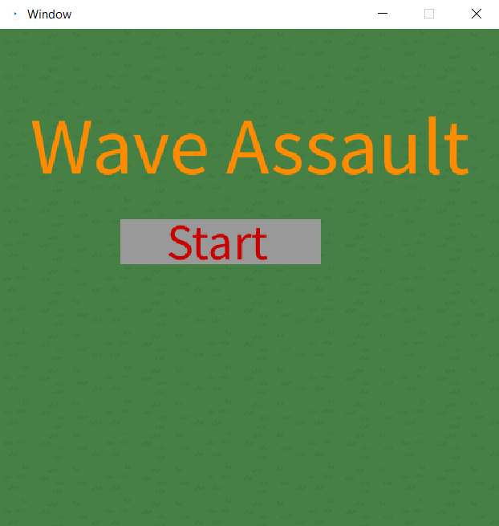
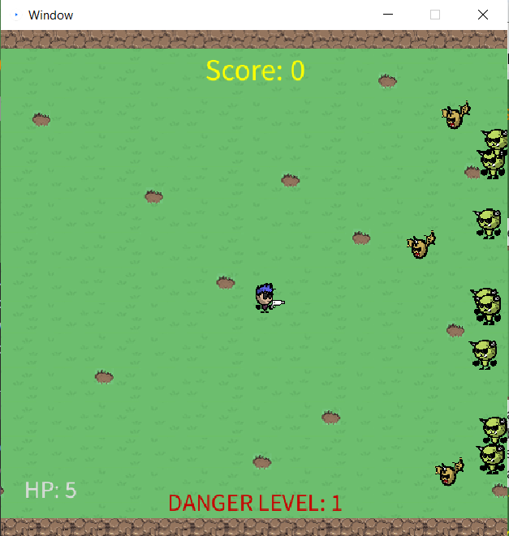
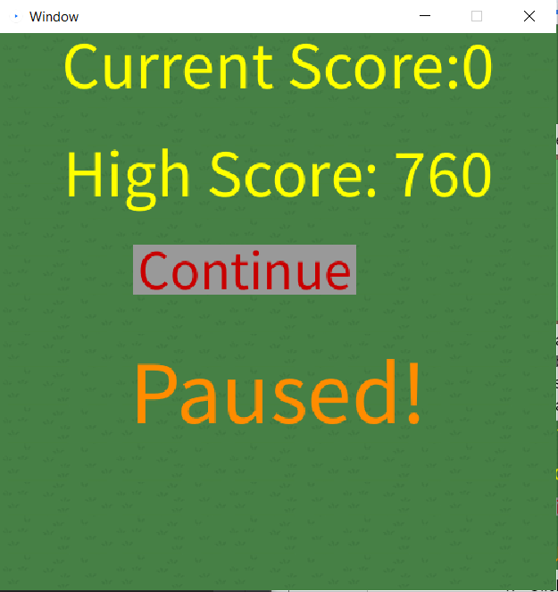
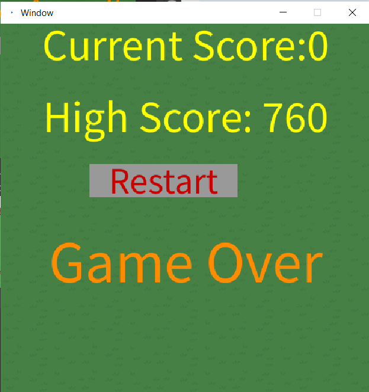

# Project Bompers - Final ReadMe

## Steps on how to run program 
- Click the start button to start the game

- If the game runs you should see enemies spawn and come towards you

- Click the arrow keys to move around
- Click the left button on your mouse to fire projectiles
- Press ‘p’ to pause in game
- Click the continue button to go back to the game

- Click the restart button to restart a new round on the end menu

## Roles and responsibilities: 
A description of each team member's jobs in the group.
- Brett
  - Implemented the database. Store the state of the game inside the DB.
  - Reading the state of a saved game from JSON to load the highscore.
  - Supported teammates in the other parts of the project.
  - Wrote the code for the base UML diagram.
  - Managed code implementation/pushes to the repo.
  - Refactoring
  - PMD and Checkstyle
- Sukh:
  - Focus on the sprites that will be used in the game such as the
    - player, enemies, background, etc.
    - focus on the movement of the sprites.
    - focus on the collision of the sprites.
  - InputHandler
  - Refactoring

- Ben:
  - Enemies
  - Enemy types
  - UI
  - Danger Level
  - HPdisplay
  - Refactoring

- Ozan:
  - Player
  - Projectiles
  - worked on the different character types (was later refactored)
  - Checkstyle
  - Refactoring

- Amarjot:
  - Created the start,pause, and end menu
  - Implemented the score and how to display it
  - Refactoring

## References / Citations
- Processing org references for Papplet: https://processing.org/reference/

## Technical Project Requirements and Project Pitch

The minimum requirements for the project are outlined here to give you a starting point. Meeting the minimum requirements alone will not guarantee you a good mark. You are welcome to meet and exceed the minimum requirements if you have good, creative ideas and would like to discuss them with me.

**Requirement 1**: The project must incorporate some visual interface using Processing.org libraries. All user interaction must be conducted via this interface.

- Requirement 1 will be met by us using PApplet. We will be using it for sprites such as the player and enemies and will be also using it for the projectiles and background.

**Requirement 2**: The project must incorporate some kind of non-blocking concurrent/asynchronous processing that happens at regular intervals. For example, you might push or fetch data from in the background.

- Requirement 2 will be met by implementing a danger level, score, saving and anything else that we may think of during development. (save state/ some process that API call and gets back)

**Requirement 3**: The project must incorporate some kind of non-trivial persistent data state that must be read, processed, and written at regular intervals. For example, you might save a game state in a JSON file. This may or may not be included with Requirement 2.

- Requirement 3 will be met by having a current score, and hp stat (description of where the enemies are, or can play the game from the same spot, file.io)

**Requirement 4**: The project must incorporate some kind of self-managing custom iterable data structure. For example, you might have a collection of enemies that are added and deleted based on statistics maintained by the data structure.

- Requirement 4 will be met by having enemies added/removed from arraylists when they spawn/die. (stats, self balancing list, data structures)

**Requirement 5**: The project must be well-documented, complete, and run without errors on final submission.

- Requirement 5 will be met by having javadoc code where it’s possible, UML, CLASS diagrams.

## Project Pitch

*One-liner*:
- Wave defense survival game. Enemies will walk/fly at you from the edge, and you fire projectiles at them to defend yourself and try to live as long as possible.

*Outline*: 1-10 sentences that describe how your project will fulfill the project requirements.(See above)
- Wrote a sentence for each requirement above.

*Communication policies*: A description of how your group will meet, communicate, and make decisions (as per Lab 03).

Group Setting work:
When you start your group work, you will be expected to decide the following and adhere to your decisions. I will provide an outline here as a minimum requirement, but you are expected to explicitly negotiate group norms and expectations on top of what I provide.

1Q.) Every group member must be on a common chat application, and must check and respond to messages within a day during normal business hours.

1A.) Common Chat we will be using is Discord.

2Q.) Every group member must volunteer to take on project tasks and complete them by the associated deadlines. These tasks MUST be managed using GitHub issues. Each group member is responsible for creating and closing GitHub issues for tasks they have taken on.

2A.) There are certain tasks that will arise such as enemies going towards the player, walls, backgrounds. Out of these tasks group members will volunteer and will have a google doc showing who is working on what and when it was finished.

3Q.) The group must meet at least once during the week outside of class time to discuss the status of project tasks. All group members must be present during this meeting.

We will be having weekly meetings at least once a week in the library where we study. Otherwise if circumstances change Discord will be used to notify everyone.

4Q.) For official/important decision-making meetings, an ongoing minutes document must be maintained where attendance and group decisions are recorded.

We will keep track of attendance using an excel managed by one designated group member. Our group decisions will be recorded on google Doc so that everyone has access and can talk about changes in our meetings.

5Q.) Groups must decide on a way of formally negotiating disputes. Default will be consensus with 2/3rds majority vote unless another system is explicitly decided upon.

We will solve disputes by using a voting system. This system will have the two people in disagreement excluded from the vote while the other three members vote on their opinion.  The majority from this vote is what will be agreed on and apply to all members.

1.Q)Meeting time and format: when will you meet and how?

Have a formal meeting a least once a week, typically a Monday after classes are done in the library. This will be to bring up what the group members have accomplished throughout the week and if they are struggling. If we cannot meet in person, discord will be used instead.

2.Q)Communications expectations and format: what times of day are people available and by which medium?

The communications will be held over discord, the availability will be 7 days a week and have a response within 24 hours if a question was asked by someone or a member needs something from another.

3.Q)Roles and responsibilities: who will do what part of the group aspects of the project, including project management?

Our plan is to help each other when needed so roles are TBD.

4.Q)Abilities and expectations: how much effort do people want to put into the project and in what areas do they have expertise?

Expectation currently is to get a working prototype and scale up from there. At the moment no one has an area of expertise, everyone will try their best at approaching the problem and ask for help if needed.

*Milestones*: A rough outline of the major project milestones that you expect to complete and your own estimated timeline. This can and will change, so do your best to estimate and plan for the milestones to change.
- Make a basic wave implementation where a player stands in the middle and enemies will charge the player. Due date Feb 7.
